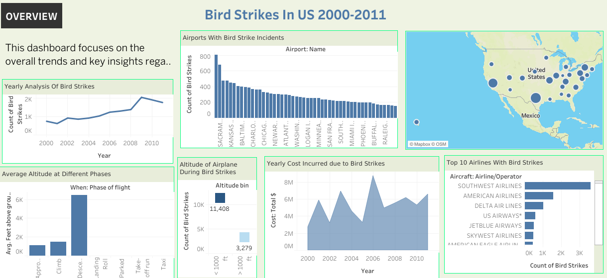
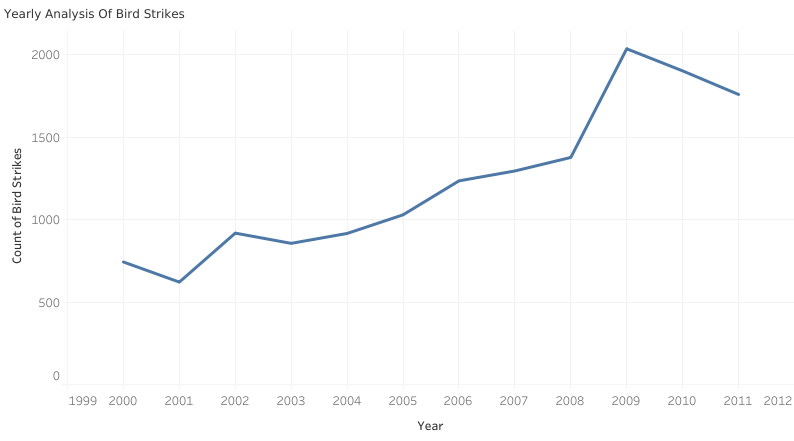
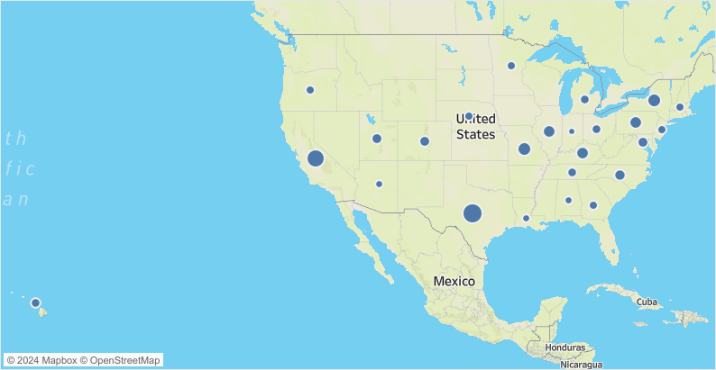
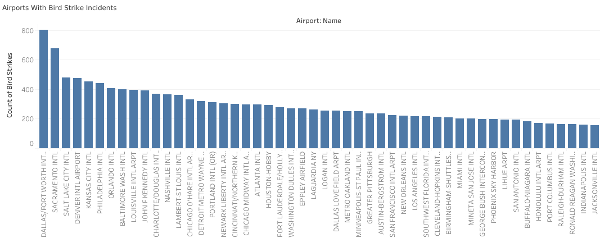
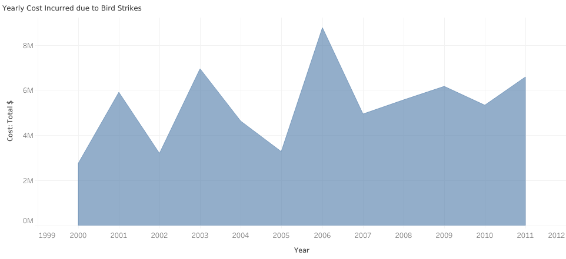
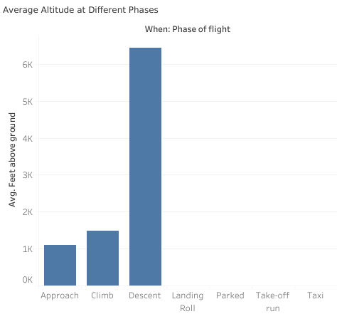

# Bird Strikes on Aircraft: Analysis and Visualization

## Problem Statement
Transport and communication are crucial domains in the field of analytics. Environmental impacts and safety are two major concerns of the scientific community, particularly in relation to transportation scenarios and the ever-growing urban areas.

Bird strikes, defined as collisions between birds and aircraft during flight, take-off, or landing, pose a significant threat to aviation safety. These incidents can lead to severe damage to aircraft, particularly to jet engines, and have resulted in fatal accidents. Understanding the occurrence and implications of bird strikes is vital for improving aviation safety measures.

This project visually depicts data collected on bird strikes by the FAA between 2000 and 2011, analyzing patterns, costs, and impacts.

## Key Business Questions
The analysis addresses several critical questions:
1. **What is the overall trend of bird strikes over the years?**  
   Analyzing how the frequency of bird strikes has changed from 2000 to 2011.
  
2. **Which airlines are most affected by bird strikes?**  
   Identifying the top airlines that have encountered the most incidents.

3. **What are the most problematic airports regarding bird strikes?**  
   Analyzing which airports have the highest number of bird strike incidents.

4. **What are the costs incurred due to bird strikes?**  
   Evaluating the financial impact of bird strikes on the aviation industry.

5. **In which phases of flight do most bird strikes occur?**  
   Investigating the flight phases (takeoff, landing, etc.) that are most commonly associated with bird strikes.

6. **How does altitude affect the likelihood of bird strikes?**  
   Analyzing the altitude of aircraft during bird strikes to identify risk factors.

7. **What is the average altitude of airplanes in different phases at the time of a strike?**  
   Examining the altitudes at which strikes occur across various flight phases.

8. **What is the impact of bird strikes on flight safety?**  
   Understanding the consequences of bird strikes on aircraft operations and passenger safety.

9. **How does the effect of a strike vary at different altitudes?**  
   Investigating whether the altitude at the time of a strike influences the severity of the impact.

10. **Were pilots informed prior to a bird strike?**  
    Analyzing data on pilot awareness of bird strikes before they occurred.

11. **What is the relationship between prior warnings and the effect of strikes?**  
    Exploring how prior notifications may affect the outcomes of bird strikes.

## Visuals Depicting Bird Strikes

### 1. Overall Dashboard

### 2. Yearly Bird Strikes Analysis

### 3. Map of Bird Strikes in the US

### 4. Airports with Most Bird Strike Incidents

### 5. Yearly Costs Incurred Due to Bird Strikes

### 6. Altitude and Phase of Flight Analysis

## Recommendations

Based on the analysis of bird strikes, the following recommendations are made:

1. **Enhanced Monitoring**: Airports and airlines should implement improved wildlife monitoring systems to reduce the risk of bird strikes, particularly during critical phases of flight.

2. **Pilot Training**: Training programs for pilots should include strategies for dealing with bird strikes, including how to respond if a bird strike occurs during takeoff or landing.

3. **Wildlife Management**: Airports should collaborate with local wildlife management organizations to minimize bird populations near airports, thereby reducing the likelihood of strikes.

4. **Regular Review of Data**: Continuous analysis of bird strike data can help identify trends and inform proactive measures to enhance safety.

## Conclusions

Bird strikes represent a significant risk in the aviation industry. Through this analysis, we identified key trends in bird strike occurrences, costs incurred, and factors influencing incidents. 

By implementing the recommended measures, the aviation sector can improve safety for both passengers and crew, ultimately leading to a reduction in bird strike incidents. Future studies should aim to include more recent data and explore the impact of climate change on wildlife behavior near airports.

## Tableau Visualization

You can view the full interactive dashboard on Tableau Public using the link below:

[Bird Strikes Dashboard on Tableau Public](https://public.tableau.com/app/profile/oliseh.okiah/viz/BirdStrikes1_17296970948280/Dashboard2)
